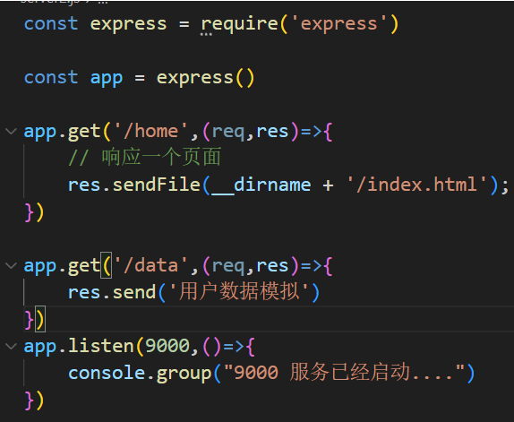

# My ajax study notes

Thanks to 
- https://www.bilibili.com/video/BV1WC4y1b78y/?p=30&vd_source=b5478c42863436502e06e157b062d81d
- https://www.expressjs.com.cn/starter/installing.html
- https://blog.csdn.net/WinstonLau/article/details/79426871
  
## enviornment
- Server operating environment: node.js
- Backend server simulation: express
- Front-end web page: html, css
- ajax: XMLHttpRequest, Axios
  
  

## axios

## express

## response
